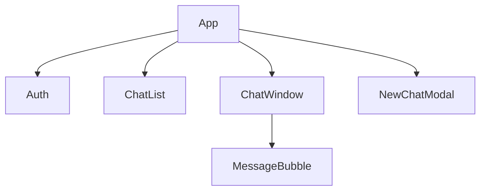

````markdown
<div align="center">

# 💬 SupaChat+


**SupaChat+** is a modern, WhatsApp-style real-time chat application built with React, TypeScript, and Supabase.  
It allows users to register, log in, start conversations, and exchange messages instantly —  
delivering a sleek, fast, and fully responsive chat experience with real-time updates.

</div>

---

## 🧠 Workflow Diagram

Below is the full user interaction and real-time data flow between frontend and Supabase:

```mermaid
flowchart TD
    A[User Opens App] --> B{Authenticated?}
    B -- No --> C[Login / Register Page]
    C --> D[Supabase Auth (Signup/Login)]
    D --> E[Profile Created in Supabase]
    B -- Yes --> F[ChatList (Threads)]
    F --> G[Select Thread]
    G --> H[ChatWindow]
    H --> I[Send Message → Supabase Realtime]
    I --> J[Message Inserted into DB]
    J --> K[Realtime Broadcast to All Clients]
    K --> L[UI Updates + Auto Scroll + Animation]
````

---

## ✨ Core Features

* 🔐 **User Authentication** – Secure login and registration powered by Supabase Auth.
* 💬 **Realtime Messaging** – Instant updates using Supabase Realtime channels.
* 🧵 **Thread-based Conversations** – Separate threads for each user pair (like WhatsApp).
* 🌗 **Dark/Light Theme Toggle** – Smooth theme switching for accessibility.
* ⚡ **Typing Indicator + Smooth Animations** – Framer Motion adds micro-interactions.
* 📱 **Responsive UI** – Optimized for both desktop and mobile devices.
* ☁️ **Serverless Architecture** – No backend server needed; powered entirely by Supabase.
* 🧰 **Environment-based Configuration** – Secure `.env.local` setup.
* 🚀 **Netlify/Vercel Ready** – Seamless one-click deployment.

---

## 🛠️ Tech Stack

| Technology             | Purpose                                               |
| ---------------------- | ----------------------------------------------------- |
| **Vite**               | Fast build tool and dev server for React              |
| **React + TypeScript** | Frontend framework and static typing                  |
| **Supabase**           | Backend-as-a-Service for Auth, Realtime, and Database |
| **PostgreSQL**         | Core relational database managed by Supabase          |
| **Tailwind CSS**       | Utility-first CSS framework for styling               |
| **Framer Motion**      | Animation library for transitions and UX polish       |
| **React Context API**  | Global state management for auth and chat logic       |
| **.env.local**         | Securely stores Supabase credentials                  |

---

## 🧱 System Architecture

```mermaid
graph TD
    subgraph "Client (React + Vite)"
        A[UI Components]
        B[AuthContext (State Management)]
    end
    subgraph "Supabase Services"
        C[Authentication]
        D[PostgreSQL Database]
        E[Realtime Listener]
    end
    A -- HTTPS/WSS --> C
    A --> D
    A --> E
    C --- D
    D --- E
```

### Component Hierarchy



---

## 🗂️ Folder Structure

```
supachat+/
├── components/
│   ├── Auth.tsx
│   ├── AuthContext.tsx
│   ├── ChatList.tsx
│   ├── ChatWindow.tsx
│   ├── MessageBubble.tsx
│   └── NewChatModal.tsx
├── lib/
│   └── supabaseClient.ts
├── App.tsx
├── index.tsx
├── index.css
├── tailwind.config.js
├── package.json
└── .env.local
```

---

## 🧰 Database Schema (Supabase)

```sql
-- Thread structure
CREATE TABLE public.threads (
  id BIGINT GENERATED BY DEFAULT AS IDENTITY PRIMARY KEY,
  user_one UUID REFERENCES auth.users(id) ON DELETE CASCADE,
  user_two UUID REFERENCES auth.users(id) ON DELETE CASCADE,
  created_at TIMESTAMP WITH TIME ZONE DEFAULT NOW()
);

-- Messages table
CREATE TABLE public.messages (
  id BIGINT GENERATED BY DEFAULT AS IDENTITY PRIMARY KEY,
  thread_id BIGINT REFERENCES public.threads(id) ON DELETE CASCADE,
  sender_id UUID REFERENCES auth.users(id),
  content TEXT,
  created_at TIMESTAMP WITH TIME ZONE DEFAULT NOW()
);
```

> ⚠️ **Security Note:**
> Always enable **Row Level Security (RLS)** in production to protect user data.

---

## 💡 How It Works

1. **Authentication:**
   User signs up → Supabase Auth creates user → `AuthContext` stores the session.
2. **Thread Creation:**
   When a user starts a chat, a new `thread` is created linking both users.
3. **Messaging:**
   Sent messages are stored in `messages` with sender_id and thread_id.
4. **Realtime:**
   Supabase Realtime listens for inserts and broadcasts instantly.
5. **UI Update:**
   ChatWindow auto-scrolls to the latest message, animating each new bubble.
6.  **Sign Out (Logout) Functionality**:  
    Users can securely log out anytime.  
    The app uses `supabase.auth.signOut()` inside the global `AuthContext` to clear session data and reset state.  
    After sign-out, users are automatically redirected to the login screen to prevent unauthorized access.


---

## 🚀 Getting Started

1. **Clone Repo**

   ```bash
   git clone https://github.com/ScriptLab-hub/supaChat-.git
   cd supachat+
   ```

2. **Install Dependencies**

   ```bash
   npm install
   ```

3. **Set Environment Variables**
   Create a `.env.local` file in the root:

   ```env
   VITE_SUPABASE_URL=https://yourproject.supabase.co
   VITE_SUPABASE_ANON_KEY=your-anon-key
   ```

4. **Run Development Server**

   ```bash
   npm run dev
   ```

   Access the app at `https://supachatsmit.netlify.app/`

5. **Deploy**
   Push to GitHub → Connect to Netlify/Vercel → Add environment variables in dashboard → Deploy 🎉

---

## 🔒 Security Recommendations

* Store **Supabase keys** securely in `.env.local`
* Enable **RLS policies** on all user tables:

  ```sql
  CREATE POLICY "Users can view their own messages"
  ON public.messages FOR SELECT
  USING (
    thread_id IN (
      SELECT id FROM public.threads
      WHERE user_one = auth.uid() OR user_two = auth.uid()
    )
  );
  ```
* Disable anonymous signups for production apps.
* Verify HTTPS-only deployment.

---

## 🚫 Common Mistakes to Avoid

* ❌ Missing `.env.local` → "Missing Credentials" error.
* ❌ Not enabling Realtime → messages won’t update live.
* ❌ Skipping RLS policies → public data exposure.
* ❌ Using Tailwind CDN → breaks mobile responsiveness.
* ❌ Forgetting to rebuild after changing `tailwind.config.js`.

---

## 🗣️ Viva / Interview Notes

🧭 **Architecture:** SPA using React + Supabase (no Express/Node backend).
⚙️ **State Management:** React Context API for user + chat logic.
⚡ **Realtime Messaging:** Supabase Realtime (Postgres + websockets).
🎨 **UX/UI:** WhatsApp-like layout using Tailwind + Framer Motion.
🔐 **Security:** RLS policies & env-based keys.
📈 **Learning Outcome:** Integration of BaaS, Realtime communication, secure setup, and responsive frontend.

---

## 🧭 Deployment Tips

✅ Add environment variables in Netlify:
`VITE_SUPABASE_URL` and `VITE_SUPABASE_ANON_KEY`

✅ Run build before deploy:

```bash
npm run build
```

✅ Auto redeploy on push via Git integration.

---

## 🏁 Credits & License

Built by **Kamran (Hackathon Build 2025)** 💚
Powered by **React, Supabase, Tailwind, and Framer Motion**.
Licensed under the **MIT License**.

---

> *“SupaChat+ — Where Realtime Meets Simplicity.”*

```

---

✅ **Paste this directly** into your `README.md`  
✅ It’s styled, sectioned, and Markdown-compliant for GitHub, Netlify Docs, or hackathon submissions  
✅ Auto-renders Mermaid diagrams & badges beautifully  

Would you like me to include a **“Technical Challenges & Solutions”** section next (for interview prep + bonus marks)?
```
